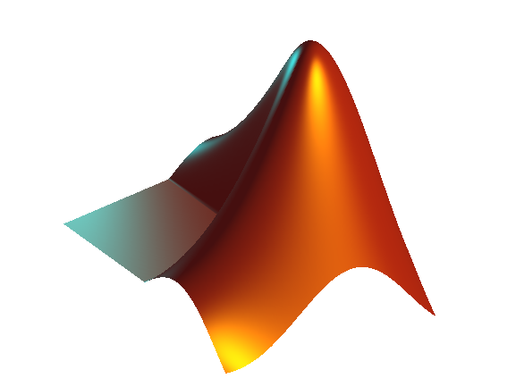

<h1 align="center">Hi, I'm Lang, you may also call me Dodge</h1>

[](https://git.io/typing-svg)

<!-- visitors amount -->


<h3 align="left">👤 Who Am I?</h3>

- 💻 Full-stack software engineer working with **TypeScript, React, Node.js/NestJS, and PostgreSQL**
- ☁️ **AWS Certified Solutions Architect - Associate**, interested in backend, cloud, and remote product engineering
- 🧰 I build web products, visual editing tools, Python utilities, and open-source localization software
- ⚙️ Once worked on a large commercial **C++/Qt 3D engineering codebase**
- 🧭 Recently I have been building and polishing **[Career Radar](https://anlan.store/jobs)**, an invite-only job radar and inbox, and **[PulseBoard](https://anlan.store/demo/)**, a monitoring and background-job demo
- 🤖 My recent experiments live somewhere between **AI agents**, **job search**, and product engineering: **OpenAI-compatible API**, **Hono**, **Redis**, **BullMQ**, **Prisma**, and **Docker Compose**. Some are deployed, some are still being carefully convinced to behave
- 💬 Find my professional experience on <a href="https://linkedin.com/in/lang-he-a94655120" target="blank"></a>
- 📡 My engineering roots are in **[digital signal processing](https://github.com/search?q=owner%3ADodgeHo+digital-signal-processing&type=repositories)**, which still shapes how I approach difficult technical problems
- 🔭 Fun fact 1: I used to excel at studying **[Digital Signal Processing](https://github.com/search?q=owner%3ADodgeHo+digital-signal-processing&type=repositories).**
- 📄 Fun fact 2: **I thought I was going to be a novelist, but I am not talented enough.**
- 🔭 Fun fact 3: Academic API debugging log:
    ```diff
    + ✅PhD Offers Received in 2023:
    +   • A? @ FinLand
    +   • LiU @ Sweden
    +   • Uni.lu @ Luxembourg
    - Visa Endpoint Response:
    -   {"status": 429, "error": "🚫RegionRateLimitExceeded"}
    ```
    

<h3 align="left">🛠️ Languages and Tools:</h3>

**Product stack**

<p align="left">
  
  
  
  
  
  
  
  
  
  
  
</p>

**Cloud and delivery**

<p align="left">
  
  
  
  
  
  
  
</p>

**Additional engineering background**

<p align="left">
  
  
  
  
  
</p>

<h3 align="left">📊 GitHub Activity</h3>
<picture style="padding-left: 30px;">
  <source media="(prefers-color-scheme: light)" srcset="https://raw.githubusercontent.com/DodgeHo/DodgeHo/output/github-contribution-grid-snake.svg">
  
</picture>

<div style="clear: both;"></div>

<h3 align="left">📘 My Top Open Source Projects </h3>
<!-- Projects -->
<p align="left" style="padding-left: 40px;">
  <a href="https://github.com/DodgeHo/VMD_cpp">
    
  </a>
  <a href="https://github.com/DodgeHo/VMD_2D_cpp">
    
  </a>
  <a href="https://github.com/DodgeHo/CEEMDAN_cpp">
    
  </a>
  <a href="https://github.com/DodgeHo/VMD_2D_python">
    
  </a>
  <a href="[https://github.com/DodgeHo/MATLAB_Tutorials_and_Exercise](https://github.com/DodgeHo/PAL4_EnglishMod)">
    
  </a>
  <a href="https://github.com/DodgeHo/ASOfront">
    
  </a>
  <a href="https://github.com/DodgeHo/dynamic_rrt_connect">
   
  </a>
  <br /><br /><br />
  <a href="https://github.com/DodgeHo?tab=repositories">
    
  </a>
</p>

<h3 align="left">📧 Connect with me:</h3>
<p align="left" style="padding-left: 40px;">
  <a href="mailto:asdsay@gmail.com" style="display: inline-block;">
    
  </a>
  <a href="https://fb.com/100007929610024" target="blank" style="display: inline-block;">
    
  </a>
  <a href="https://www.leetcode.com/dodgeho" target="blank" style="display: inline-block;">
    
  </a>
</p>

- Reach me at **asdsay@gmail.com** or **lang.he.dodge@qq.com**
