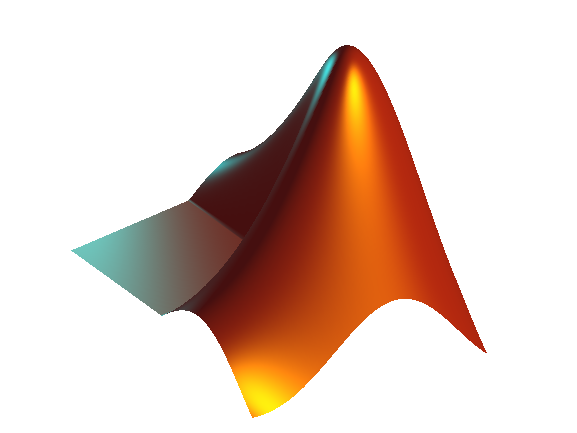

<h1 align="center">This is Dodge</h1>

[](https://git.io/typing-svg)

<!-- visitors amount -->


<h3 align="left">👤 Who Am I?</h3>

- 🌱 I’m currently learning **React & Node/Nest/Next/Nuxt**
- ⚡ Ask me about **C++, React or Next.js**
- 💬 Know about my experiences via <a href="https://linkedin.com/in/lang-he-a94655120" target="blank"></a>
- 🔭 Fun fact 1: I used to excel at studying **[Digital Signal Processing](https://github.com/search?q=owner%3ADodgeHo+digital-signal-processing&type=repositories).**
- 📄 Fun fact 2: **I thought I was going to be a novelist, but I am not talented enough.**
- 🔭 Fun fact 3: Academic API debugging log:
    ```diff
    + ✅PhD Offers Received in 2023:
    +   • A? @ FinLand
    +   • LiU @ Sweden
    +   • Uni.lu @ Luxembourg
    - Visa Endpoint Response:
    -   {"status": 429, "error": "🚫RegionRateLimitExceeded"}
    // I don't blame Europe or my homeland, I blame Donald Trump.
    ```
    

<h3 align="left">🛠️ Languages and Tools:</h3>
<p align="left" >

- 🚀 **Familiar with:**
  <!-- list1 -->
  
   
   
   
   
   
   
   
   
   
  

- 💻 **Also have hands-on experience with:**
    <!-- list2 -->
    
     
     
    
    
    
    
    
    
    
    
    
    
    
  </p>

<h3 align="left">📊 My activities on Github：</h3>
<p style="padding-left: 40px;"> 
  
  
</p>
<picture style="padding-left: 30px;">
  <source media="(prefers-color-scheme: light)" srcset="https://raw.githubusercontent.com/DodgeHo/DodgeHo/output/github-contribution-grid-snake.svg">
  
</picture>

<div style="clear: both;"></div>

<h3 align="left">📘 My Top Open Source Projects </h3>
<!-- Projects -->
<p align="left" style="padding-left: 40px;">
  <a href="https://github.com/DodgeHo/VMD_cpp">
    
  </a>
  <a href="https://github.com/DodgeHo/VMD_2D_cpp">
    
  </a>
  <a href="https://github.com/DodgeHo/CEEMDAN_cpp">
    
  </a>
  <a href="https://github.com/DodgeHo/VMD_2D_python">
    
  </a>
  <a href="https://github.com/DodgeHo/MATLAB_Tutorials_and_Exercise">
    
  </a>
  <a href="https://github.com/DodgeHo/ASOfront">
    
  </a>
  <a href="https://github.com/DodgeHo/dynamic_rrt_connect">
   
  </a>
  <br /><br /><br />
  <a href="https://github.com/DodgeHo?tab=repositories">
    
  </a>
</p>

<h3 align="left">📧 Connect with me:</h3>
<p align="left" style="padding-left: 40px;">
  <a href="mailto:asdsay@gmail.com" style="display: inline-block;">
    
  </a>
  <a href="https://fb.com/100007929610024" target="blank" style="display: inline-block;">
    
  </a>
  <a href="https://www.leetcode.com/dodgeho" target="blank" style="display: inline-block;">
    
  </a>
</p>

- Reach me at **asdsay@gmail.com** or **lang.he.dodge@qq.com**
